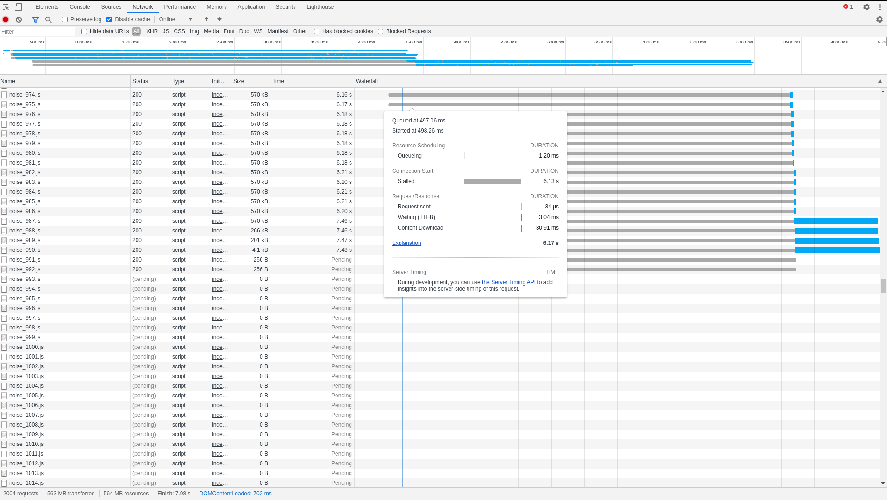

# Reproduction of Chrome Bug (Ticket 1124263)

This small repo is used to reproduce a bug that I find when developing an SPA in chrome.


## TLDR

To reproduce it, just run

```sh
./run.sh
```

And open chrome on http://127.0.0.1:8080/


## Requirements

- Bash
- Docker


## Explanation

The run.sh performs the following steps:

1. Generates 2000 junk js files
2. Runs a dockerized nginx serving static files from src on port 80

When navigation to the url, the `index.html` requires `index.js` which writes
2000 script tags requiring the 2000 junk files we generated.

On my machine, chrome freezes around request number 100, producing the following
on the network tab:


